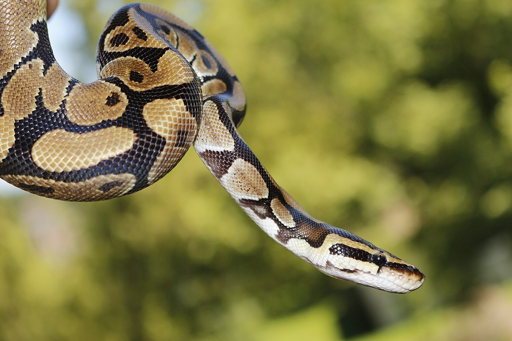

# My poem about Python 🐍
## Yellow and blue 🧷
#### By Mr Ward

Pythons are the best. They are by far the **most *intesting* snake**

yellow<br>yellow
**YELLOW**

## Why are they Great
- they slither
- they bite
- they help you automate tasks

#### and many colours
1. Green
2. Yellow
4. Blue
    - light blue
    - dark blue
5. orange




[more pythons](https://en.wikipedia.org/wiki/Pythonidae)

```python 
# This is the code I ran for testing
for i n range(100):
    print(i * i)
```

# Number of snakes I have

Kind          | Number   | mice per day 
 ------------ | ---      | ---
 python       | 50       | 100
 cobra        | 4        | 6
 Black mamba  | 2        | 16
 Rattle snake | 18       | 5